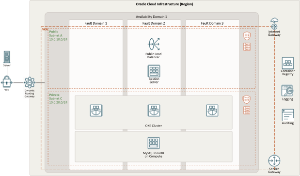
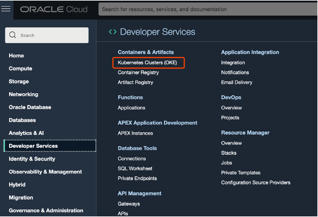
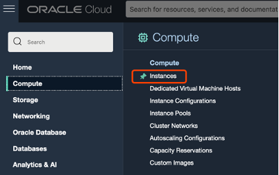
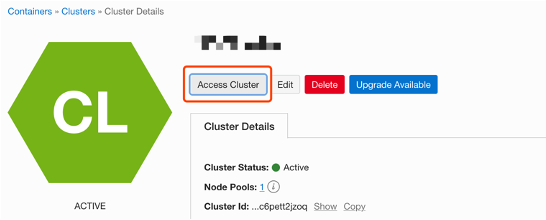

# Deployment Path: DIY

## How It Works



## Let's build it

**a. Create OKE Kubernetes cluster. VCN and corresponding network resources will be created automatically.**
    
1. Click the Navigation Menu on the upper left, navigate to Developer Services, select Kubernetes Clusters (OKE)




2. Choose Quick Create as it will create the new cluster along with the new network resources such as Virtual Cloud Network (VCN), Internet Gateway (IG), NAT Gateway (NAT), Regional Subnet for worker nodes, and a Regional Subnet for load balancers. Select Launch Workflow

3. Keep the name to cluster1 and the other default values, click Next to review the cluster settings.

4. Click Create


**b. Create a bastion host compute instance**

1. Click the Navigation Menu on the upper left, navigate to Compute, select Instances



2. Click Create Instance

3. Change Name to Operator

4. In Networking section, select VCN and public subnet created with OKE

5. In Add SSH keys section, click Save Private Key and Save Public Key to save the private and public keys for SSH access


6. Click Create

**c. Create MySQL InnoDB on compute**

1. Create a compute instance using Oracle Linux 8 operating system

    1.1 Primary network: select “Select existing virtual cloud network” and the same VCN as the OKE cluster in the drop-down list

    1.2 Subnet: select “Select existing subnet” and  the OKE Private subnet in the drop-down list

    1.3 Upload the ssh `<public-key-file>` once the instance is ready. Note the `<instance-private-ip-address>`.

2. Start Cloud Shell

3. Copy the instance-private-key-file to Cloud shell (drag and drop from download to cloud shell window)

4. Change the permissions 
    ```
    chmod 400 <private-key-file>
    ```

5. Copy the instance-private-key-file to the bastion host and log into the bastion host
    ```
    scp -i <private-key-file> <private-key-file> opc@<bastion-host-address>:/home/opc
    ssh -i <private-key-file> opc@<bastion-host-address>
    ```

6. Install MySQL community edition server

    6.1 Type the install command
    ```
    sudo yum install mysql-server -y
    ```

    6.2 Start the MySQL server
    ```
    sudo service mysqld start
    ```

    6.3 Make sure the MySQL server is running
    ```
    sudo service mysqld status
    ```

    6.4 During the installation process, the user‘root’@’localhost’ is automatically created without password

    6.5 Log in the MySQL server
    ```
    mysql -u root
    ```

    6.6 Create root password 
    ```
    mysql> ALTER USER 'root'@'localhost' IDENTIFIED BY ‘<new_password>’;
    ```

    6.7 Create a new user to access the database remotely
    ```
    mysql> CREATE USER 'mysqluser'@'%' IDENTIFIED BY 'mysqluser'; 
    ```
    Note: '%' indicates that it will allow all IP addresses

    6.8 MySQL is now installed and ready to use
    ```
    mysql> show databases;
    ```

**d. Set up schema and data in MySQL Database**

1. SSH to bastion host from cloud shell

2. Install MySQL Shell on bastion host

3. Connect to MySQL Database with MySQL Shell
    ```
    mysqlsh -h <MySQL host> -p 'mysqluser' -u mysqluser
    ```

4. Create database and table
    ```
    \sql
	CREATE DATABASE webappdb;
    use webappdb;
    CREATE TABLE `employee_data`( `id` int(11) NOT NULL AUTO_INCREMENT PRIMARY KEY, `first_name` VARCHAR(50) NOT NULL, `last_name` VARCHAR(50) NOT NULL, `gender` VARCHAR(50) NOT NULL, `email` VARCHAR(50) NOT NULL, `hire_date` VARCHAR(50) NOT NULL, `department` VARCHAR(50) NOT NULL, `job` VARCHAR(50) NOT NULL, `salary` DECIMAL(10,2) NOT NULL )AUTO_INCREMENT=1;
    show tables;
    ```

**e. Build webapp container images and push them to OCI Container Registry**

1. Create container registries

    1.1 Click the Navigation Menu on the upper left, navigate to Developer Services, select Container Registry.

    1.2 Click Create repository.

    1.3 Create 2 public repositories named `webapp/php` and `webapp/nginx`.

2. Build container images

    2.1 Navigate to Cloud Shell.

    2.2 Clone this git repo.

    2.3 Go to Nginx source folder.
    ```
    cd 1a_diy/src/nginx
    ```

    2.4 Build Nginx container image.
    ```
    docker build -t <region_key>.ocir.io/<tenancy_namespace>/webapp/nginx:1.0 .
    ```
    Note: <region_key> can be found using OCI CLI command `oci iam region list --output table` then refer to the key of the region and <tenancy_namespace> using `oci os ns get`.

    2.5 Go to PHP source folder.
    ```
    cd ../php
    ```

    2.6 Build PHP container image.
    ```
    docker build -t <region_key>.ocir.io/<tenancy_namespace>/webapp/php:1.0 .
    ```
    Note: <region_key> can be found using OCI CLI command `oci iam region list --output table` then refer to the key of the region and <tenancy_namespace> using `oci os ns get`.

3. Push container images

    3.1 Login to OCI Container Registry
    ```
    docker login <region_key>.ocir.io -u <tenancy_namespace>/oracleidentitycloudservice/<username> -p <auth_token>
    ```
    Note: <region_key> can be found using OCI CLI command `oci iam region list --output table` then refer to the key of the region and <tenancy_namespace> using `oci os ns get`. For <auth_token>, click Profile on the top right corner of OCI console, then click on your username. On the bottom left pane, click Auth Token and Generate Token.

    2.7 Push Nginx and PHP container images to container registries
    ```
    docker push <region_key>.ocir.io/<tenancy_namespace>/webapp/nginx:1.0
    docker push <region_key>.ocir.io/<tenancy_namespace>/webapp/php:1.0
    ```


**f. Deploy application to OKE Cluster**

1. Set up OKE cluster access on cloud shell

    1.1 Click on the OKE cluster you created

    1.2 Click Access Cluster

    

    1.3 Follow the steps to set up OKE cluster access on cloud shell

    

    1.4 Update the MySQL host IP address in 1a_diy/deploy/mysql_config.yml, credentials in 1a_diy/deploy/mysql_secret.yml and container image locations of php and nginx in 1a_diy/deploy/deploy-webapp.yml

    1.5 Deploy the application
    ```
    kubectl apply -f 1a_diy/deploy/mysql_config.yml
    kubectl apply -f 1a_diy/deploy/mysql_secret.yml
    kubectl apply -f 1a_diy/deploy/deploy-webapp.yml
    ```

## Resources

[LiveLabs](https://apexapps.oracle.com/pls/apex/dbpm/r/livelabs/view-workshop?wid=651&clear=180&session=3650076810239)

[Refernce Architecture](https://docs.oracle.com/en/solutions/ha-web-app/index.html)

[MAD Framwork](https://docs.oracle.com/en/solutions/mad-web-mobile/index.html)

[OKE Documentation](https://docs.oracle.com/en-us/iaas/Content/ContEng/home.htm)