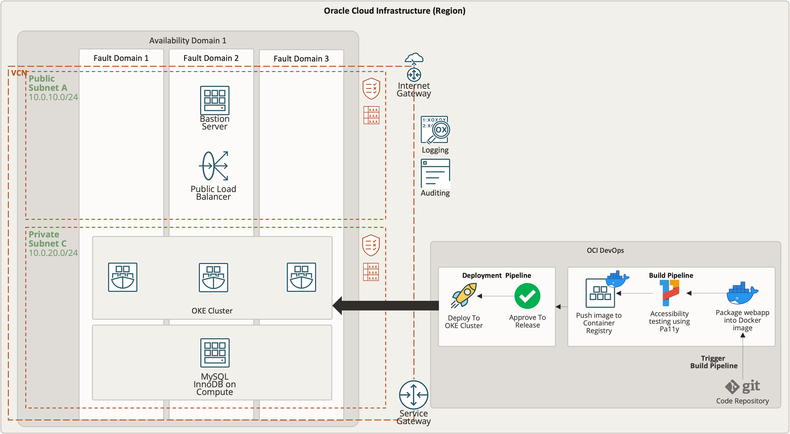

# Deployment Path: DIY with CICD (Click to Deploy)

## How It Works



## Let's build it

**a. Provision resources using OCI Resource Manager**

1. Press the button below to provision the resources through OCI Resource Manager.

    [](https://cloud.oracle.com/resourcemanager/stacks/create?zipUrl=https://<replace_zipfile>)

2. Input the configurations. You will need to upload an openssh public key.
3. Click Next.
4. Check the "Run apply" button and press "Save changes" to run the job.

    

5. Wait for the job to complete.
6. When the job is completed, click on the "Application information" tab and click on the Bastion URL.
7. Under "Sessions", click on the 3 dots and press "Copy SSH command".

    
    
8. Paste the SSH command on your favourite terminal to access the mysql_instance via OCI Bastion.

**b. Create MySQL InnoDB on compute**

1. Install MySQL community edition server

    1.1 Type the install command
    ```
    sudo yum install mysql-server -y
    ```

    1.2 Start the MySQL server
    ```
    sudo service mysqld start
    ```

    1.3 Make sure the MySQL server is running
    ```
    sudo service mysqld status
    ```

    1.4 During the installation process, the user‘root’@’localhost’ is automatically created without password

    1.5 Log in the MySQL server
    ```
    mysql -u root
    ```

    1.6 Create root password 
    ```
    mysql> ALTER USER 'root'@'localhost' IDENTIFIED BY ‘<new_password>’;
    ```

    1.7 Create a new user to access the database remotely
    ```
    mysql> CREATE USER 'mysql'@'%' IDENTIFIED BY 'mysqluser'; 
    ```
    Note: '%' indicates that it will allow all IP addresses

    1.8 MySQL is now installed and ready to use
    ```
    mysql> show databases;
    ```

**c. Set up schema and data in MySQL Database**

1. Create database and table
    ```
	CREATE DATABASE webappdb;
    use webappdb;
    CREATE TABLE `employee_data`( `id` int(11) NOT NULL AUTO_INCREMENT PRIMARY KEY, `first_name` VARCHAR(50) NOT NULL, `last_name` VARCHAR(50) NOT NULL, `gender` VARCHAR(50) NOT NULL, `email` VARCHAR(50) NOT NULL, `hire_date` VARCHAR(50) NOT NULL, `department` VARCHAR(50) NOT NULL, `job` VARCHAR(50) NOT NULL, `salary` DECIMAL(10,2) NOT NULL )AUTO_INCREMENT=1;
    show tables;
    ```

**d. Build and Deploy webapp**

1. Update the build spec file located in 1b_diy_cicd/build/build_spec.yml

    1.1 Change the `<php_container_repo>` in line 27, 29 and 89 to `<region-key>.ocir.io/<tenancy-namespace>/webapp/php`.

    1.2 Change the `<nginx_container_repo>` in line 41, 43 and 87 to `<region-key>.ocir.io/<tenancy-namespace>/webapp/nginx`.

    1.3 You may find the `<region-key>` for your region in this [link](https://docs.oracle.com/en-us/iaas/Content/General/Concepts/regions.htm) and `<tenancy-namespace>` can be found by clicking on the container repository in the Container Registry service.

    1.4 Update the `<region-key>`, `<Username>` and `<Auth_Token>` in line 85. `<Username>` is `<TenancyName>/<Federation>/<UserName>`for federated user or `<TenancyName>/<YourUserName>` for OCI IAM user. `<Auth_Token>` is the one created in step 4.2. `<TenancyName>`, `<Federation>` and `<UserName>` can be found by clicking the user icon on the top right of the web console.

    **Note**: For production implementation, please use OCI Vault to store the Auth_Token instead of inserting it in the build spec file as clear text. Refer to this [link](https://docs.oracle.com/en-us/iaas/Content/devops/using/build_specs.htm) on how to add secret in OCI Vault as a variable in a build spec file.

2. Go back to OCI Resource Manager console, click on the "Application information" tab and click on the Code repo URL to access the code repository.
3. Push source code to the repository.

    3.1 Create Auth Token to authenticate to OCI Code Repository. Follow the steps in this [link](https://docs.oracle.com/en-us/iaas/Content/devops/using/getting_started.htm#authtoken)

    3.2 Add OCI Code Repository as a remote. The repo URL can be found by clicking **Clone**.

    ```
    git remote add oci-code-repo <repo_url> --mirror=push
    ```

    3.3 Push the source code to OCI Code Repository.

    ```
    git push oci-code-repo
    ```

    When prompt for username, key in the username as `<TenancyName>/<Federation>/<UserName>`for federated user or `<TenancyName>/<YourUserName>` for OCI IAM user. `<TenancyName>`, `<Federation>` and `<UserName>` can be found by clicking the user icon on the top right of the web console.

3. Go back to OCI Resource Manager console, click on the "Application information" tab and click on the Build Pipeline URL to access the build pipeline.
4. Click Start manual run -> Start manual run to run the build pipeline. After the build pipeline is completed, the deployment pipeline will be triggered automatically.

**e. Access the Webapp**

1. After the deployment is completed successfully, go back to OCI Resource Manager console, click on the "Application information" tab and click on the Webapp URL to access the application.