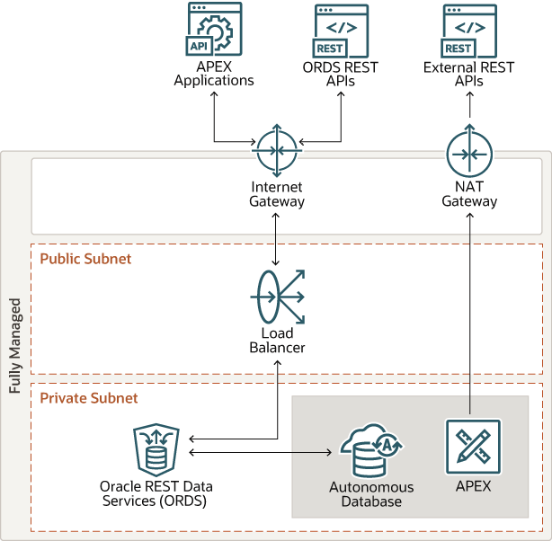
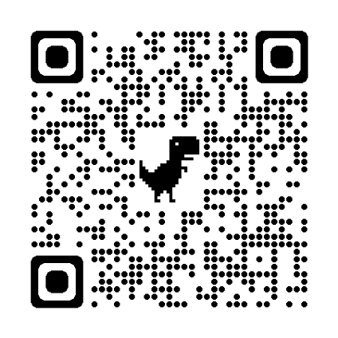
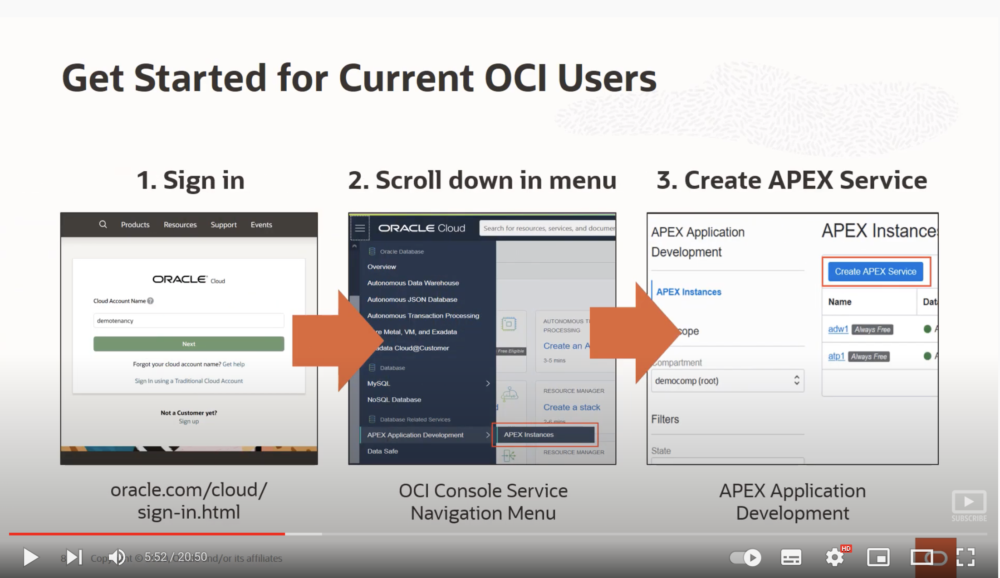
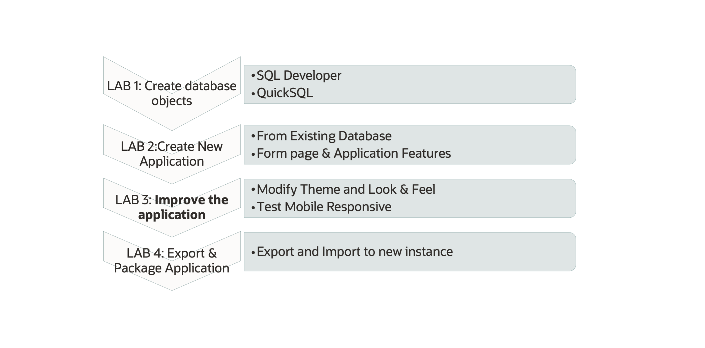
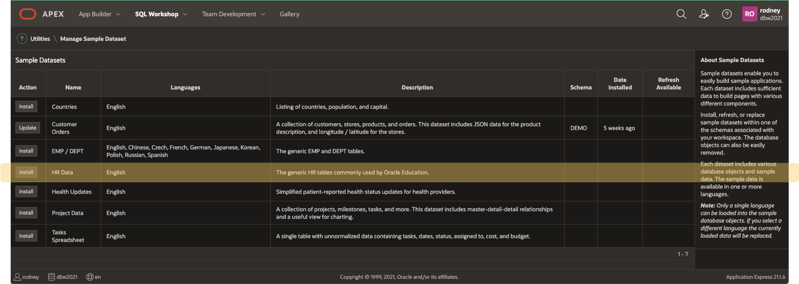
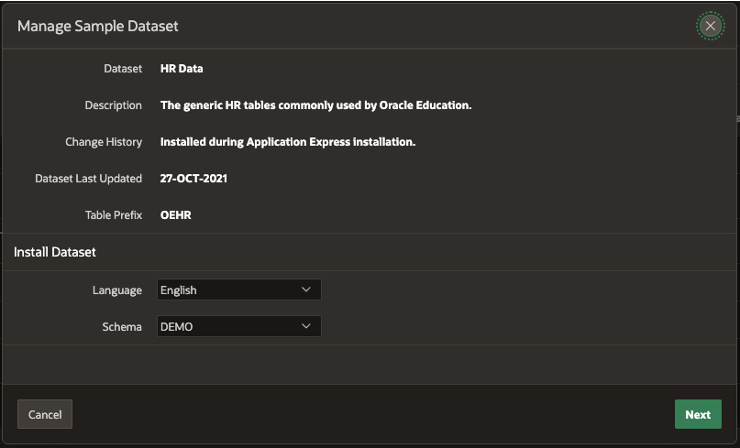
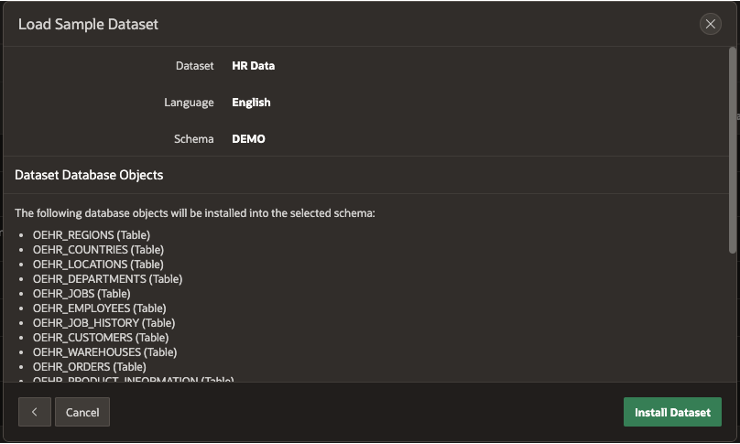
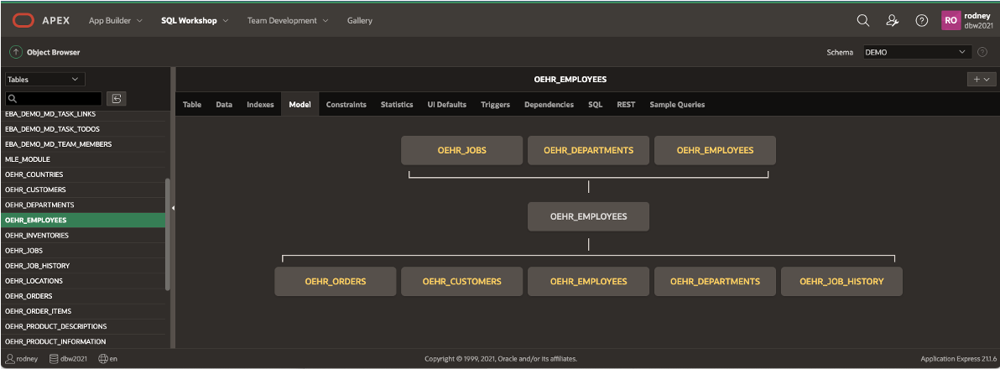
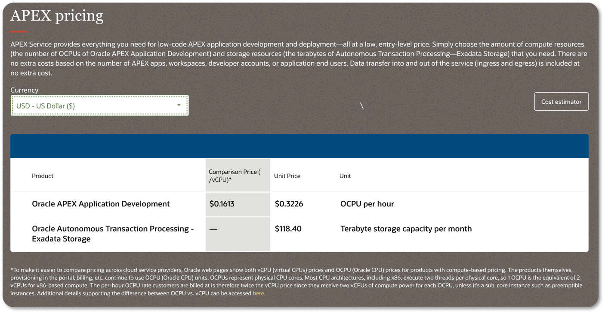

# Deployment Path: Managed

## How It Works

More information on this reference architecture can be found here [Modern App Development - Low Code](https://docs.oracle.com/en/solutions/low-code-apps-maf/index.html#GUID-00EB39C3-54A5-4C2E-B06D-B19DA7762BE3)

Other reference architecture [link](https://docs.oracle.com/solutions/?q=&cType=modern-app-development&sort=date-desc&lang=en)
## Let's build it

### Getting your environment ready

#### Get started with…
<table>
<tr><td>

</td><td>

Always-free access to essential services: 
- Autonomous Database
- Virtual machines
- Object storage

Plus, $300 of credits for 30 days to use on even more services: 
- Container Engine for Kubernetes
- Analytics Cloud
- Data Integration

[signup.cloud.oracle.com
](signup.cloud.oracle.com)

</td></tr>
</table>

Once you have signed up you will need to login into your tenancy.

You are all set and ready to explore APEX. First lets take a look at the overview below.

### Overview

First we will need to Provision a APEX Service instance. (Recommend to choose the Always Free version), where after we will create workspace for you and team, and finally build an app.

#### 1. Provision an APEX Service Instance

Set up Oracle APEX Application Development by creating and setting up an APEX Service instance.

``

Follow the [guide](https://docs.oracle.com/en/cloud/paas/apex/gsadd/create-and-set-up-apex-service-instance.html#GUID-E859A921-1A00-4FAC-8B75-877B7CF60986
) or watch the video below.

#### 2. Create APEX Workspace 

#### Set Up a New APEX Service

In this part, you will create an Oracle APEX Workspace. An APEX Workspace is a logical domain where you define APEX applications. Each workspace is associated with one or more database schemas (database users) which are used to store the database objects, such as tables, views, packages, and more. APEX applications are built on top of these database objects.

``

[Follow the guide here.](https://docs.oracle.com/en/cloud/paas/apex/gsadd/create-and-set-up-apex-service-instance.html#GUID-8F6578FF-95FC-4D3E-BBA6-FBA9BB624A4A
)

#### 3. Create APEX Application

#### What are we building

In this section we will build a “Employee Directory” application which includes, Employee Directory, Employee Registration form and Employee Registry Admin functions. The application will have two application roles: 

**Administrators** 
To manage the Employee Registry 
To access a dashboard to identify the Employees by department. Etc.

**Employees** 
To register 
To review, update, their details

#### LAB Overview

#### LAB 1: Create database objects

**Introduction** 
In this lab, you will learn how to install sample tables and views from Sample Datasets. This sample dataset is a collection of customers, stores, products, and orders used to manage the shopping cart.

- Task 1: Create HR Employee Tables
- Task 2: Review Database Objects

##### Task 1 Create HR Employee Tables
1. From the APEX workspace homepage, click SQL Workshop > Utilities > Sample Datasets.
2. Click on the “Install” button for the HR Dataset to install the sample dataset.

3. Keep the default setting for Language and Schema ( this is the schema for your current workspace)
4. Click Next

5. Review the Tables and Views that will be created for this Sample Dataset
6. Click “Install Dataset

7. The dataset has been loaded and now you have the option to create the application but as we would like to review the schema that has been created… Click “Exit” button for now.

##### Task 2: Review Database Objects

1. Navigate to SQL Workshop > Object Browser

You will see all the Tables created for this dataset. You can view the Views by toggle the Dropdown menu on the left bar from Tables to View

2. In the Tables view, locate OEHR_EMPLOYEES table and click to view the details.
3. Select the Model Tab to view the relationships
4. Click the other tables and the various tabs, such as Data, Constraints, and so forth, to review the table details. 

This completes Lab 1. You now know how to install a HR sample dataset. You may now proceed to the next lab.

#### LAB 2: Create New Application

**Introduction**
In this lab, you will build an application based on the data structures you built in previous labs. 
Estimated Time: 15 minutes 
Watch the video below for a quick walk through of the lab. 

- Task 1: Create an Application
- Task 2: Name the Application
- Task 3: Create an Application
- Task 4: Add the Dashboard Page
- Task 5: Add the Company Directory Page
- Task 6: Add the Employee Registration Page

#### LAB 3: Improve the application

**Introduction**
In this lab, you will learn how to improve the Company Directory Page page by adding new facets and customizing the cards. And change the Theme of your application

- Task 1: Add new Facets
- Task 2: Reorder Facets
- Task 3: Enhance the Faceted Search
- Task 4: Enhance the Cards Region
- Task 5: Change the application Theme

#### LAB 4: Export & Package Application

**Introduction**
In this lab, you will learn how to Export the Application

- Task 1: XXXX
- Task 2: XXX
- Task 3: XXX
- Task 4: …
- Task 5: …

## Resources

<table>
<tr><td>

</td>
<td>

</td>
<td>

</td></tr>
</table>

<!---
For example
--- [LiveLabs](https://apexapps.oracle.com/pls/apex/dbpm/r/livelabs/view-workshop?wid=651&clear=180&session=3650076810239)
--- [Refernce Architecture](https://docs.oracle.com/en/solutions/ha-web-app/index.html)
--- [MAD Framwork](https://docs.oracle.com/en/solutions/mad-web-mobile/index.html)
--->

## License

